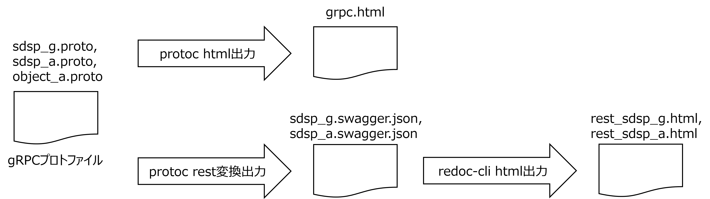

# ウラノスGEX ドローン領域API仕様

### 概要

-   ドローン領域のAPI仕様です。
-   空間ID仕様については以下のリンクを参照して下さい。
    <!--[Digital Architecture Design Center 4次元時空間情報基盤 ガイドライン](https://www.ipa.go.jp/digital/architecture/project/autonomousmobilerobot/3dspatial_guideline.html)-->
    
<a href="https://www.ipa.go.jp/digital/architecture/project/autonomousmobilerobot/3dspatial_guideline.html" target="_blank">Digital Architecture Design Center 4次元時空間情報基盤アーキテクチャガイドライン</a>

### （1）領域横断仕様

空間IDや座標など共通の型をProtcolBuffer形式で定義した仕様。領域横断のAPIも定義する。
|仕様名|ファイル名|
|----|----|
|gRPC定義|sdsp_g.proto|
|OpenAPI仕様|sdsp_g.swagger.json|
|RESTインターフェース仕様|rest_sdsp_g.html|

### （2）ドローン領域API仕様

APIプロトコルには、gRPCおよびRESTを適用する。APIはProtcolBuffer形式で定義する。仕様書の可読性を上げるために、下図に示す方法でhtml化を行う。実装にあたっては、gRPCにおいてはprotoファイルを、RESTにおいてはOpenAPIを活用することを推奨する。
|仕様名|ファイル名|
|----|----|
|gRPC定義|sdsp_a.proto, object_a.proto|
|gRPCインターフェース仕様|grpc.html|
|OpenAPI仕様|sdsp_a.swagger.json|
|RESTインターフェース仕様|rest_sdsp_a.html|

-   gRPC定義（sdsp_g.proto, sdsp_a.proto, object_a.proto）
-   gRPCインタフェース仕様（grpc.html）：gRPC定義をhtmlに整形したもの
-   OpenAPI仕様（sdsp_g.swagger.json, sdsp_a.swagger.json）：gRPC定義をOpenAPI表現に変換したもの
-   RESTインタフェース仕様（rest_sdsp_g.html, rest_sdsp_a.html）：OpenAPI仕様をhtmlに成形したもの
