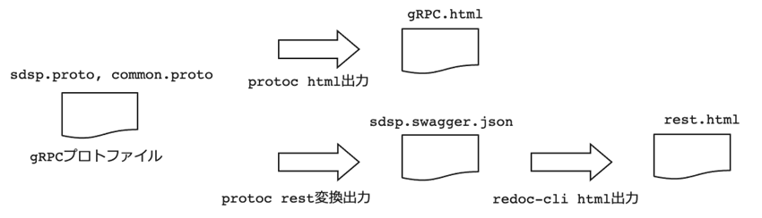

# ウラノスGEX ドローン領域API仕様

### （1）領域横断仕様
空間IDや座標など共通の型をProtcolBuffer形式で定義した仕様。領域横断のAPIは、各領域API仕様内に定義し、API名のプリフィックスに“GEN_”が付加される。 
|仕様名|ファイル名|
|----|----|
|gRPC定義|common.proto|

### （2）ドローン領域API仕様
APIプロトコルには、gRPCおよびRESTを適用する。APIはProtcolBuffer形式で定義する。仕様書の可読性を上げるために、下図に示す方法でhtml化を行う。実装にあたっては、gRPCにおいてはprotoファイルを、RESTにおいてはOpenAPIを活用することを推奨する。 
|仕様名|ファイル名|
|----|----|
|gRPC定義|sdsp.proto, common.proto|
|gRPCインターフェース仕様|grpc.html|
|OpenAPI仕様|sdsp.swagger.json|
|RESTインターフェース仕様|rest.html|

- gRPC定義（sdsp.proto, common.proto）
- gRPCインタフェース仕様（grpc.html）：gRPC定義をhtmlに整形したもの
- OpenAPI仕様（sdsp.swagger.json）：gRPC定義をOpenAPI表現に変換したもの
- RESTインタフェース仕様（rest.html）：OpenAPI仕様をhtmlに成形したもの
